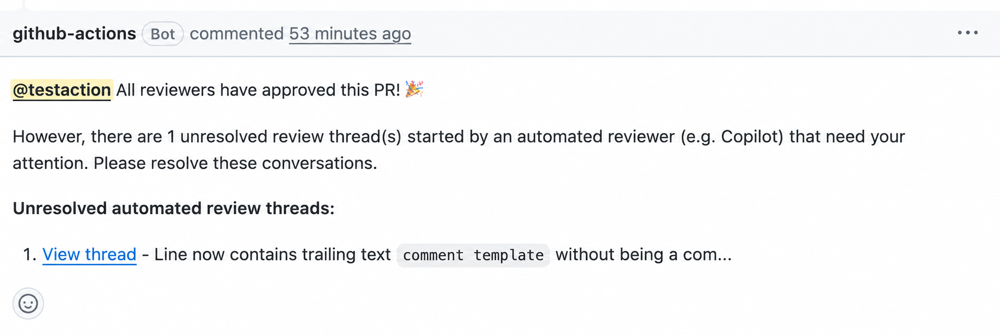

# Notify PR Author of Unresolved Bot Review Threads

A GitHub Action that reminds the PR author to resolve open review threads started by an automated reviewer (e.g. Copilot) once all human reviewers have approved.

## Features

- ✅ Checks for unresolved review threads started by an automated (bot) reviewer
- ✅ Posts a reminder comment with links to those threads
- ✅ Supports a configurable comment template
- ✅ Handles pagination for review threads
- ✅ Detects bot authors via GitHub's GraphQL `Actor.__typename` field: most bot/App reviewers (whose accounts GitHub types as `Bot`) are covered automatically, without maintaining a list of known bot logins

## How it works

1. Expects to run after an independent approval check (such as [`check-all-reviewers-approved-action`](https://github.com/kreuz123/check-all-reviewers-approved-action)) and receives its result via the `all-approved` input.
2. Skips immediately unless `all-approved` is `true`.
3. Validates the `pr-number` input.
4. Fetches all review threads with pagination and keeps unresolved threads whose first comment was authored by a `Bot`-type account.
5. Sets `has-unresolved`, `unresolved-count`, and `thread-list` outputs.
6. Posts a comment to the PR author only when unresolved bot review threads are found.

## Example reminder comment

The action posts a reminder when there are unresolved threads started by an automated reviewer:



## Usage

### Basic Usage

```yaml
name: Notify PR author of unresolved automated review threads

on:
  pull_request_review:
    types: [submitted]

permissions:
  pull-requests: write

jobs:
  notify:
    if: ${{ github.event.review.state == 'APPROVED' }}
    runs-on: ubuntu-latest
    steps:
      - name: Check approval status
        id: approval
        uses: kreuz123/check-all-reviewers-approved-action@v1
        with:
          pr-number: ${{ github.event.pull_request.number }}

      - name: Notify about unresolved automated review threads
        uses: kreuz123/notify-pr-author-unresolved-bot-threads-action@v1
        with:
          pr-number: ${{ github.event.pull_request.number }}
          all-approved: ${{ steps.approval.outputs.all-approved }}
```

### Customizing the comment

Use `comment-template` to customize the reminder comment. The template supports the following placeholders:

- `{author}` — always renders as an `@mention` so the PR author is notified. If omitted from your template, the mention is prepended automatically.
- `{unresolvedCount}` — the number of unresolved automated review threads.
- `{threadList}` — the list of unresolved threads. If omitted from your template, the thread list is appended automatically so it's never lost.

```yaml
steps:
  - uses: kreuz123/notify-pr-author-unresolved-bot-threads-action@v1
    with:
      pr-number: ${{ github.event.pull_request.number }}
      all-approved: ${{ steps.approval.outputs.all-approved }}
      comment-template: |
        Hey {author}! There are {unresolvedCount} unresolved automated review thread(s) left:
        {threadList}
```

If `comment-template` is not provided, it defaults to:

```
All reviewers have approved this PR! 🎉

However, there are {unresolvedCount} unresolved review thread(s) started by an automated reviewer (e.g. Copilot) that need your attention. Please resolve these conversations.

**Unresolved automated review threads:**

{threadList}
```

## Inputs

| Name               | Required | Default               | Description                                                                                                       |
| ------------------ | -------- | --------------------- | ------------------------------------------------------------------------------------------------------------------ |
| `token`            | No       | `${{ github.token }}` | GitHub token used to read review threads and post the comment.                                                    |
| `pr-number`        | No       |                        | Pull request number.                                                                                              |
| `all-approved`     | No       | `"true"`               | Whether the independent check-all-reviewers-approved action found all reviewers approved.                          |
| `comment-template` | No       | See `action.yml`      | Template for the reminder comment using `{author}`, `{unresolvedCount}`, and `{threadList}`.                       |

## Outputs

| Name                | Description                                                      |
| -------------------- | ----------------------------------------------------------------|
| `has-unresolved`    | Whether unresolved bot review threads were found.                |
| `unresolved-count`  | Number of unresolved bot review threads.                          |
| `thread-list`       | Markdown-formatted list of unresolved bot review threads.        |

## Required permissions

The workflow's `GITHUB_TOKEN` needs:

- `pull-requests: write` — to read review threads and post the reminder comment.

## License

This project is licensed under the [MIT License](LICENSE).
